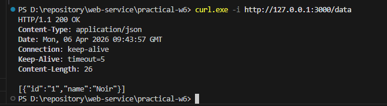
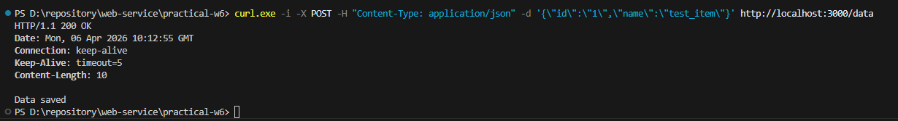
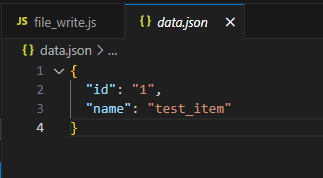
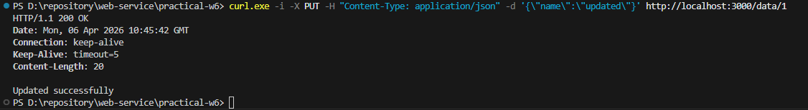
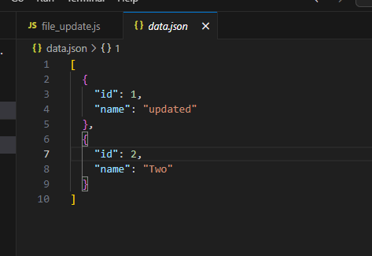
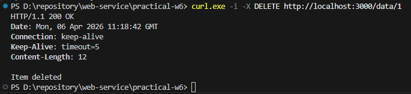
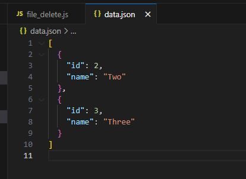

# Node.js File-Based Persistence

Практична робота № 6
Рішення практичних завдань в розділі Practice 6 - File-Based Persistence

## Список виконаних завдань:

1. File read
2. File write
3. File update
4. File delete

## Як запустити:

Для запуску любого рішення треба використати команду:
'node <назва_файлу>.js <порт>'
Наприклад: 'node solution.js 3000'

## Як перевірити:

Для швидкої ручної перевірки статус-кодів та заголовків використовуйте команду 'curl.exe -i'

6.1 FILE READ (GET): 'curl.exe -i http://localhost:3000/data' 
6.2 FILE WRITE (POST): 'curl.exe -i -X POST -H "Content-Type: application/json" -d "{\"id\":\"1\",\"name\":\"test\"}" http://localhost:3000/data' 
6.3 FILE UPDATE (PUT): 'curl.exe -i -X PUT -H "Content-Type: application/json" -d "{"name":"updated"}" http://localhost:3000/data/1' 
6.4 FILE DELETE (DELETE): 'curl.exe -i -X DELETE http://localhost:3000/data/1'

## Результат:

Статус: COMPLETED (Підтверджено ручним тестуванням) 
Незважаючи на технічні затримки автоматичної верифікації, всі вимоги гайду реалізовані та перевірені локально за допомогою curl -i

### 6.1 File read (COMPLETED):

**Результат:**

Сервер повертає коректний JSON-об'єкт та заголовок Сontent-Type: application/json.

### 6.2 File write (COMPLETED):

**Результат:**

Тіло запиту успішно проходить валідацію JSON.parse() та записується у файл.

### 6.3 File update (COMPLETED):

**Результат:**

Об'єкт знайдено через findIndex, оновлено, а інші дані залишилися без змін.

### 6.4 File delete (COMPLETED):

**Результат:**

Фільтрація через filter() пройшла успішно, статус 404 повертається при повторному видаленні.

